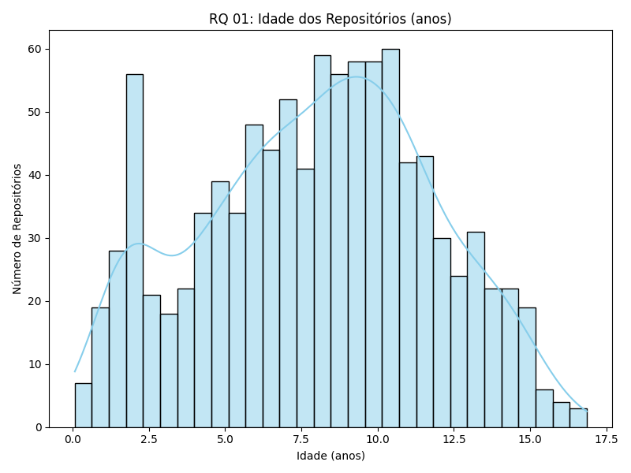
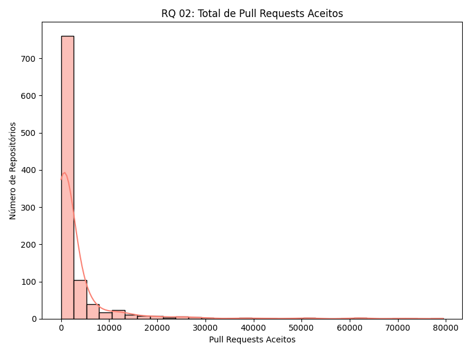
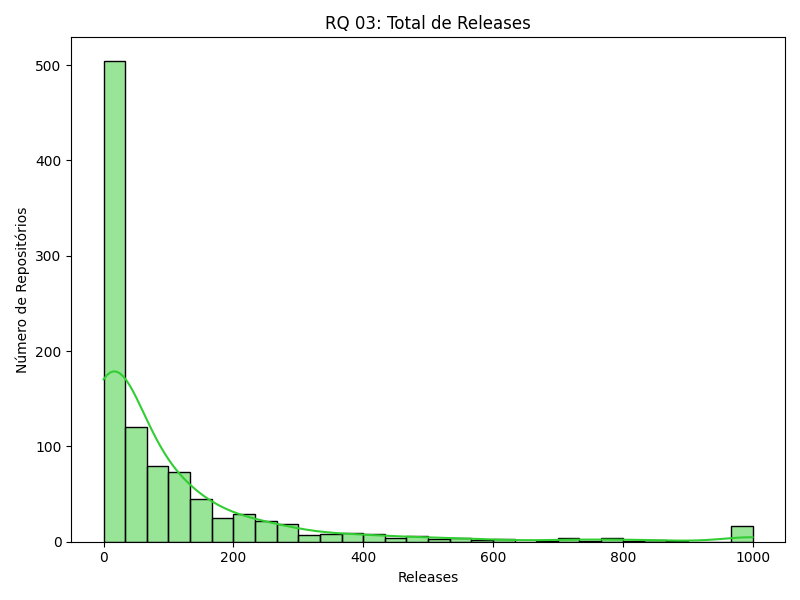
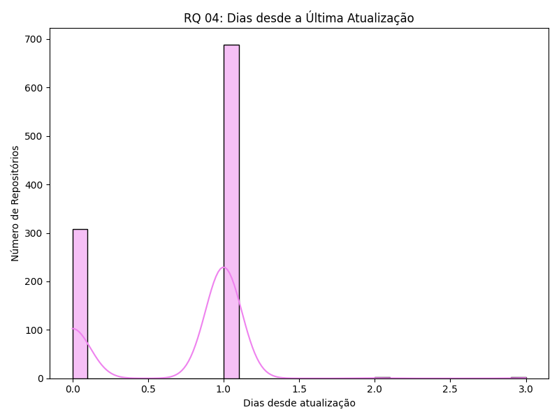
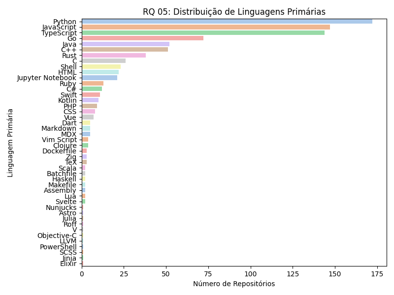
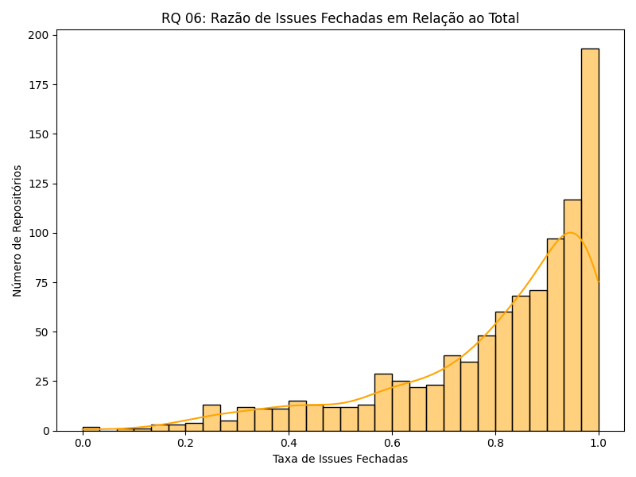

Ponticífia Universidade Católica de Minas Gerais

# **Relatório - Características de repositórios populares**

Belo Horizonte, 23 de fevereiro de 2025

Grupo: Eduardo Junqueira, Felipe Cassimiro, Gustavo Evaristo;

---
## Introdução

Este lab 01 do laboratório de experimentação de software tem o objetivo de investigar as caracteristicas dos repositórios populares. Avaliando as suas caracteristicas tais como tempo de criação, se novas versões são lancadas com frequencia entre várias questões que seram abordado neste laboratório. A abordagem metodológica deste trabalho consiste em leventar hipoteses informais sobre o tema, responder as RQ de 1 a 6 com metricas pre-selecionadas e a solução é  obter os dados da Api de github com um programa em Python e por fim visualizar os  dados  gerando imagens.

### Hipóteses Informais

1. Os repositórios populares definidos como os com mais estrelas são antigos e maduros definidos com um tempo de vida de anos.
2. Os repositórios populares tem relevancia para a comunidade definidos com o envolvimento da comnidade à partir de pull requests aceitas. 
3. Os repositórios populares possuem muitos releases definidos como muitas atualizações do código com novas funcinalidades e com frequência.

### RQ

RQ 01. Sistemas populares são maduros/antigos?

Métrica: Idade do repositório (calculado a partir da data de sua criação)

Observações:
Levando-se em conta o fator temporal, repositórios com maior tempo de existência possuem maior espaço para o "acúmulo" de estrelas, enquanto repositórios mais novos, mesmos populares e em alta, não têm a mesma exposição. A relação entre estrelas e idade do repositório pode não ser positiva em repositórios com temática em tendência, integração com frameworks altamente populares, popularidade do proprietário/mantenedor e, em casos mais raros, migração da *codebase*,  porém espera que os repositórios mais populares do Github sejam longevos (em sua maioria acima de 4 anos) por conta da exposição, provas de conceito, tempo de adoção e janela para evolução e correção de falhas, resultando em adoção maior por parte da comunidade  

 

---

RQ 02. Sistemas populares recebem muita contribuição externa?

Métrica: Total de pull requests aceitas

Observações:
Parece evidente que repositórios mais populares tendem a receber um maior número de pull requests e issues, pois são utilizados por um público mais amplo. Com um número maior de usuários, há mais chances de identificarem problemas, sugerirem novas funcionalidades e contribuírem ativamente para o projeto. Consequentemente, espera-se um volume maior de pull requests, já que mais desenvolvedores estarão engajados em corrigir erros, implementar melhorias e expandir as funcionalidades do sistema.

 

---

RQ 03. Sistemas populares lançam releases com frequência?

Métrica: Total de releases

Observações:
Não necessariamente. Acreditamos que novas releases são lançadas quando há uma maturidade significativa na nova versão, refletindo avanços importantes no desenvolvimento. No entanto, repositórios populares tendem a ter um fluxo constante de contribuições, o que pode acelerar o ritmo de novos desenvolvimentos. Ainda assim, a frequência de releases não depende apenas do volume de contribuições, mas também de processos como testes, validações e a aprovação das pessoas responsáveis pelo projeto antes do lançamento de uma nova versão.

 

---

RQ 04. Sistemas populares são atualizados com frequência?

Métrica: Tempo até a última atualização (calculado a partir da data de última
atualização)

Observações:
A hipótese é que sistemas populares tendem a precisar e ter demanda de atualizações mais frequêntes, pois são amplamente utilizados e, consequentemente, apresentam maior número de problemas, melhorias e novos requisitos. No entanto, é importante considerar que, em alguns casos, repositórios populares podem ser descontinuados ou até abandonados pelos criadores. Apesar disso, acredita-se que, em geral, quanto mais famoso um repositório, maior será o número de usuários envolvidos, o que pode resultar em uma maior frequência de atualizações, com contribuições externas e mudanças contínuas.

 

---

RQ 05. Sistemas populares são escritos nas linguagens mais populares?

Métrica: Linguagem primária de cada um desses repositórios

Observações:
Como mencionado anteriormente, repositórios populares costumam ser mais antigos, é comum que esses repositórios utilizem linguagens mais antigas, que, por vezes, podem ser menos populares hoje em dia. No entanto, repositórios mais recentes, com cerca de 10 anos ou menos, tendem a adotar linguagens mais atuais, que refletem as tendências do desenvolvimento moderno. Portanto, embora a popularidade de um repositório nem sempre se alinhe diretamente com a popularidade das linguagens que ele utiliza, repositórios mais novos tendem a ser escritos em linguagens mais populares e modernas.

 

---

RQ 06. Sistemas populares possuem um alto percentual de issues fechadas?

Métrica: razão entre número de issues fechadas pelo total de issues

Observações:
Supomos que essa hipótese é equivocada, pois repositórios mais populares tendem a ter um volume crescente de problemas e solicitações de novas funcionalidades, já que são utilizados por um número maior de pessoas. No entanto, é comum que o número de desenvolvedores envolvidos não aumente na mesma proporção, o que resulta em um alto número de issues abertas. Isso implica que, embora o repositório seja popular, pode haver um backlog considerável de issues não fechadas, já que a quantidade de contribuições muitas vezes não acompanha o aumento das demandas, levando a uma razão relativamente baixa entre o número de issues fechadas e o total de issues.

 

---

### Análise

---

### Resultados

---
